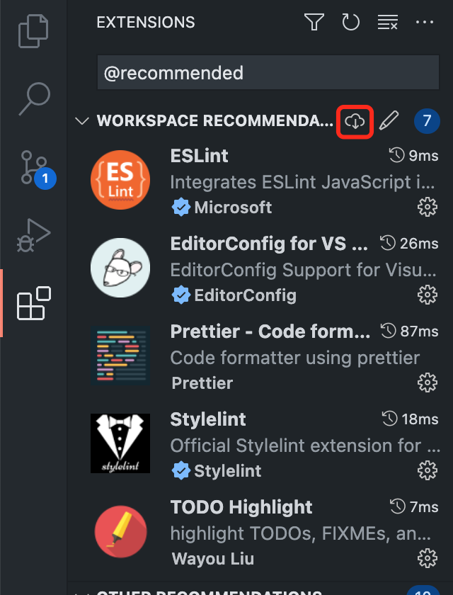

# vue-boilerplate

This template should help get you started developing with Vue 3 in Vite.

## Recommended IDE Setup

[VSCode](https://code.visualstudio.com/) + [Volar](https://marketplace.visualstudio.com/items?itemName=Vue.volar) (and disable Vetur) + [TypeScript Vue Plugin (Volar)](https://marketplace.visualstudio.com/items?itemName=Vue.vscode-typescript-vue-plugin).

## Type Support for `.vue` Imports in TS

TypeScript cannot handle type information for `.vue` imports by default, so we replace the `tsc` CLI with `vue-tsc` for type checking. In editors, we need [TypeScript Vue Plugin (Volar)](https://marketplace.visualstudio.com/items?itemName=Vue.vscode-typescript-vue-plugin) to make the TypeScript language service aware of `.vue` types.

If the standalone TypeScript plugin doesn't feel fast enough to you, Volar has also implemented a [Take Over Mode](https://github.com/johnsoncodehk/volar/discussions/471#discussioncomment-1361669) that is more performant. You can enable it by the following steps:

1. Disable the built-in TypeScript Extension
    1) Run `Extensions: Show Built-in Extensions` from VSCode's command palette
    2) Find `TypeScript and JavaScript Language Features`, right click and select `Disable (Workspace)`
2. Reload the VSCode window by running `Developer: Reload Window` from the command palette.

## Customize configuration

See [Vite Configuration Reference](https://vitejs.dev/config/).

## Project Setup

```sh
npm install
```

### Compile and Hot-Reload for Development

```sh
npm run dev
```

### Type-Check, Compile and Minify for Testing

```sh
npm run build:testing
```

### Type-Check, Compile and Minify for Staging

```sh
npm run build:staging
```

### Type-Check, Compile and Minify for Production

```sh
npm run build
```

### Run Unit Tests with [Vitest](https://vitest.dev/)

```sh
npm run test:unit
```

### Run End-to-End Tests with [Cypress](https://www.cypress.io/)

```sh
npm run test:e2e:dev
```

This runs the end-to-end tests against the Vite development server.
It is much faster than the production build.

But it's still recommended to test the production build with `test:e2e` before deploying (e.g. in CI environments):

```sh
npm run build
npm run test:e2e
```

### Lint with [ESLint](https://eslint.org/)

```sh
npm run lint
```

### Build iconfont

```
npm run iconfont:gen
```

### Node.js版本

本项目采用nvm管理Node.js版本

```bash
curl -o- https://raw.githubusercontent.com/nvm-sh/nvm/v0.38.0/install.sh | bash
```

使用项目下.nvmrc中指定的Node.js版本

```bash
nvm install && nvm use
```

关于切换到指定项目自动执行`nvm use`可以参考 [Deeper Shell Integration](https://github.com/nvm-sh/nvm#deeper-shell-integration)

## VS Code 必装插件

* [prettier](https://github.com/prettier/prettier-vscode)
* [eslint](https://github.com/Microsoft/vscode-eslint)
* [stylelint](https://github.com/stylelint/vscode-stylelint)

打开扩展，输入 `@recommended`，点击一键安装，如图所示：



## 环境变量

```bash
# 构建环境，值为：development、testing、staging、production
import.meta.env.MODE

# 应用基础路径，该值等于 import.meta.env.VITE_APP_DOMAIN + import.meta.env.VITE_APP_PREFIX
import.meta.env.BASE_URL

# 应用域名，通常用于CDN
import.meta.env.VITE_APP_DOMAIN

# 应用路径前缀
import.meta.env.VITE_APP_PREFIX

# 运行环境，值是：dev、testing、staging、prod
import.meta.env.VITE_APP_RUNTIME_ENV

# 小程序环境，值是：develop、trial、release
import.meta.env.VITE_APP_MINI_PROGRAM_ENV

# 是否启用加密
import.meta.env.VITE_APP_SECURITY
```

可通过以下方式区分各个环境

开发环境

```bash
import.meta.env.VITE_APP_RUNTIME_ENV === 'dev'
```

测试环境

```bash
import.meta.env.VITE_APP_RUNTIME_ENV === 'testing'
```

预发布环境

```bash
import.meta.env.VITE_APP_RUNTIME_ENV === 'staging'
```

生产环境

```bash
import.meta.env.VITE_APP_RUNTIME_ENV === 'prod'
```

## 部署


### 编译脚本

```bash
./scripts/nvm-patch.sh # 给nvm打补丁，让其支持通过NVM_NODEJS_ORG_MIRROR和NVM_NODEJS_ORG_ARCH来指定安装三方Node.js
NVM_NODEJS_ORG_MIRROR=https://unofficial-builds.nodejs.org/download/release/ NVM_NODEJS_ORG_ARCH=x64-glibc-217 nvm install && nvm use # 通过nvm安装指定Node.js版本，并切换到该版本
npm config set proxy null && npm config set https-proxy null # 设置代理后有一定概率会导致安装失败，因此需要将其删除
npm i && npm run build # 生产环境
# npm i && npm run build:testing # 测试环境
# npm i && npm run build:staging # 预发布环境
npm config set proxy http://squid.caiwu.corp:3128/ # 还原npm代理
tar -zcf dist.tar.gz dist nginx.conf # 将dist目录和nginx.conf文件打包到一起
```

## 根据OpenAPI生成接口的TypeScript类型声明

打开项目目录下的`openapi.config.js`进行配置

```js
export default [
  {
    src: 'mock/openapi.yml', // schema 文件的访问路径，支持本地及远程访问
    output: 'src/schemas/mock.ts', // TypeScript 文件输出位置
    trimStart: ['/api'], // 对接口前缀的路径修剪
  },
  {
    src: 'http://microloan-microcredit-test-k.jhjj.spider.test/v2/api-docs?group=1.0%E7%89%88%E6%9C%AC',
    output: 'src/schemas/microcredit.ts',
    trimStart: ['/api'],
  },
];
```

配置完成后运行以下命令

```bash
npm run openapi
```

## 通用组件目录

[X-Components](src/x-components/README.md)

## 移动端布局

**在Web移动端项目中遵循的布局准则为宽度自适应，高度固定，展示`更多内容`优于`放大内容`，图片等比缩放（通常应用于落地页，活动、小游戏等场景），文字方面除了需要配合海报的标题等，其余场景一律使用 `px` 单位。**

如下示例：


在示例中我们用横屏来模拟出在更大的屏幕上内容的展示效果，当然了事实上对不同屏幕的适配并不仅仅是这么简单，还需要配合 [@media](https://css-tricks.com/css-media-queries/)及更加现代化的 [@container](https://css-tricks.com/next-gen-css-container/) 做更精细化的布局。


上面也说了，有些场景是需要根据屏幕宽度来设置元素尺寸或边距及文字大小等等，因此为了更方便的基于设计稿中标注的尺寸进行布局，我们通过[postcss-px-to-viewport](https://github.com/evrone/postcss-px-to-viewport)自定义了一个单位 `dpx`（Design pixel），用于表示设计稿中的像素单位，最终会转换为`vw`单位。例如：

> 假设设计稿的宽度是 `750px`，此时我们需要将设计稿中的 `100px` 转为对应的 `vw`

转换公式为： **(100px / 750px) * 100vw = 13.33333vw**

```css
/* input */

.foo {
  margin-top: 100dpx;
}

/* output */

.foo {
  margin-top: 13.33333vw;
}
```

**实际上你无需关注输出的`vw`**

## 命名规则

本项目文件命名统一使用`-`中划线风格，请务必遵守。

## 路由命名规范

### 1. 路由统一使用小写字母且使用连字符`-`分隔多个单词

```js
// bad
'/bankcards/1/agreementPay'

// good
'/bankcards/1/agreement-pay'
```

根据`RFC3986`定义，路径部分对大小写是敏感的，即`/bankcards/1/agreementPay`和`/bankcards/1/agreementpay`实际上是两个地址。  

虽然在很多场景下我们可以设置其大小写是否敏感，但为了降低理解成本，因此统一使用连字符`-`分割多个单词。  

关于连字符`-`和下划线`_`的区别可参考 [Google《保持简单的网址结构》](https://developers.google.com/search/docs/advanced/guidelines/url-structure)

### 2. 根据层级结构定义路由

```js
// bad
'/points/sign-in-details'

// good
'/points/sign-in/details/:id'
```

清晰的路由命名结构能明确的表示所属关系，例如 `/bankcards/1/agreement-pay` 表示 `银行卡/银行卡详情id/开通协议支付`，如果改成 `/bankcards-agreement-pay?cardId=1`，则会使其业务模块的从属关系变得模糊不清，进而增加理解成本。

### 3. 推荐使用名词+复数的形式命名路由 **(建议)**

```js
// bad
'/getUser/1/getSetting'

// goods
'/users/1/settings'
```

实际上这条建议来自于 `RESTful API` 设计，但对于路由的设计同样适用，在路由中所有的请求 `method` 都是 `GET`，本身就表达了读取/获取的意思，因此路由命名中不应该出现`getXxx`之类的命名。

而关于 `复数` 的建议主要是因为多数情况下我们获取的是一个集合，部分情况下获取单个资源，为了保持一致的结构，因此统一使用复数命名，如下示例：

```js
// 新闻列表
'/news'

// 新闻详情
'/news/1'
```

## 图标

将SVG图标文件放到 `src/assets/icons` 目录中，项目中就可以直接这样使用 `<IconCustomSuccess />` 或 `<icon-custom-success />`，其中`IconCustom`或`icon-custom`为固定值，已经在 `vite.config.ts` 中配置, 详细介绍可参考 [unplugin-icons](https://github.com/unplugin/unplugin-icons#usage)

### iconfont

将`svg`图标放置到`combine-icons/fonts`目录中，运行`npm run iconfont:gen`命令，即可通过`<x-font-icon name="success" />`方式使用图标

## 压缩字体文件

1. 在 `minify-fonts/fonts` 目录中存放字体文件和需要提取的文字，例如：

  * `minify-fonts/fonts/Roboto-Medium-12.ttf` 是字体文件

  * `minify-fonts/fonts/Roboto-Medium-12.txt` 中存放需要提取的文字，如：`0123456789`

2. 执行以下命令

```bash
npm run minify:fonts
```

> 压缩后的字体文件将会放在 `src/assets/font` 目录中  

3. 在需要使用该字体文件的CSS中参考以下方式使用

```css
@import '@/assets/font/Roboto-Medium-12.css';

.foo {
  font-family: 'Roboto-Medium-12';
}
```

## CSS Sprites

由于某些情况下无法使用SVG图标解决大量图片请求的问题，因此基于传统的CSS Sprites实现图片的合并。

该功能仅在`测试环境`和`生产环境`启用，`本地开发环境`不启用。

### 使用方式

```css
/* input */
.foo {
  background: url(@/assets/img/xxx.png?__sprite=foo);
}

.bar {
  background: url(@/assets/img/xxx.png?__sprite=foo);
}

/* output */
.foo {  
  background-image: url(/img/foo.png);
  background-position: -256px -205px;
  background-size: 297px 295px;
}

.bar {
  background-image: url(/img/foo.png);
  background-position: -210px -214px;
  background-size: 297px 295px;
}


/* input */
.foo2 {
  background: url(@/assets/img/xxx@2x.png?__sprite=foo);
  background-size: 100% 100%;
}

.bar2 {
  background: url(@/assets/img/xxx@2x.png?__sprite=foo);
  background-size: 100% 100%;
}

/* output */
.foo2 {  
  background-image: url(/img/foo@2x.png);
  background-position: -256px -205px;
  background-size: 297px 295px;
}

.bar2 {
  background-image: url(/img/foo@2x.png);
  background-position: -210px -214px;
  background-size: 297px 295px;
}
```

说明：  

1. `?__sprite=` 为固定参数，`foo` 表示当前图片合并到哪个图片分组下，多个图片指定同一分组，则会被合并到该分组生成一张图片。
2. 注意当图片是`多倍图`需要遵循标准的命名规则，即 `example@2x.png`，`example@3x.png`。

## K8S 部署支持非覆盖式发布

1. 在对应服务下 -> 基本配置 -> 挂载配置 -> 添加文件存储，容器内路径 `/app/nginx/webapp/archive` 挂载到相关的文件存储中。

关于文件存储的创建与挂载详细请看：

- [创建文件存储](http://docs.paas.creditease.corp/file_storage/create_storage.html)
- [挂载文件存储](http://docs.paas.creditease.corp/file_storage/mount_storage.html)

2. 构建脚本中将 `scripts/combine-archive.sh` 打包到 `dist.tar.gz` 文件中

```bash
tar -zcf dist.tar.gz dist nginx.conf scripts/combine-archive.sh
```

3. 启动命令前先执行 `combine-archive.sh` 脚本

```bash
/app/nginx/webapp/scripts/combine-archive.sh && /app/nginx/sbin/nginx -c /app/nginx/webapp/nginx.conf
```
